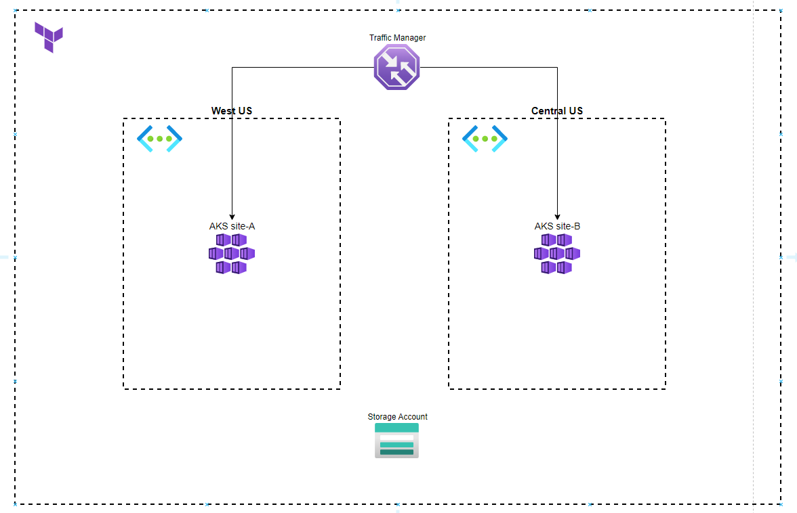

# azure-terraform-aks-dr

Deploy AKS Disaster and Recovery cross-region scenario

## Progress

- [X] diag.io diagram
- [ ] main terraform deployment
- [ ] network terraform module
- [ ] AKS terraform module
- [ ] Traffic Manager terraform module
- [ ] AKS stateless workload
- [ ] AKS stateful workload
- [ ] AKS addons - externaldns, ingress, external secrets
- [ ] AKS addons - monitoring (kube-prometheus-stack)
- [ ] AKS DR (Velero | AKS feature)
- [ ] Diagram as Code
- [ ] Deployment scripts (AWS Deploy | Github Actions | Jenkins | Terraform Enterprise)
- [ ] traffic generator terraform module
- [ ] code security scanning (BridgeCrew | Snyk)

## Network Diagram

